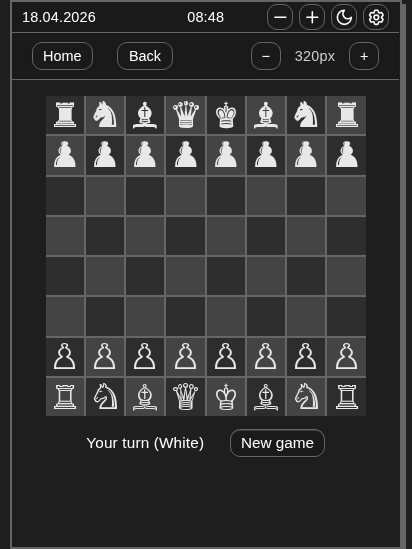
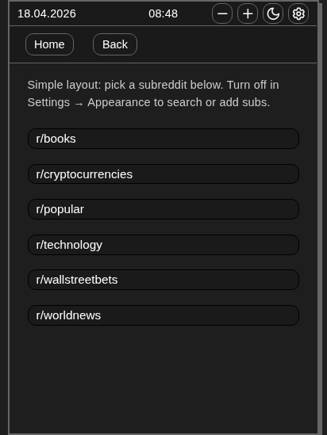

# LibreInk

**LibreInk – The Easy Way of E-Ink Hacking**

A minimal, plugin-based launcher for low-spec and e-ink devices. It provides a home screen, status bar, and a set of built-in apps that run inside a shared shell—tuned for Kindle, grayscale displays, and slow hardware.

## Features

- **Home screen** – **Apps** and **Games** sections; optional **Pinned** row (configure in Settings) for quick access without duplicating tiles in the main grid. Touch and click both supported for reliable launch on Kindle. Extra side padding gives a scroll gutter so swiping doesn’t open apps by mistake. Scroll-vs-tap detection ignores taps when the pointer has moved (reduces accidental launches on Kindle).
- **Status bar** – Zoom (+ / −), theme toggle (light/dark), clock, compact controls. Clock updates every 60s by default, or every 5 minutes during **quiet hours** when that option is enabled (fewer wakeups on e-ink).
- **Settings** – Performance profile (**normal** / **low power**), reader image mode (full / lazy / text), offline behavior, quiet hours, home pins, one-tap display presets (e.g. outdoor / night), **export/import** settings JSON, **diagnostics** (version, build id, storage key count, last network error), and cache tools.
- **Network layer** – Bounded concurrency (stricter in low power), optional in-flight GET dedupe, optional **`AbortSignal`** on `fetchText` / `fetchJson`, and **offline block** when the device reports offline and settings demand it.
- **Single-page legacy build** – One HTML file and one JS bundle (no ES modules), so it runs on Kindle, Silk, and other no-ESM browsers. Black-and-white SVG icons where needed. **Version** and **build id** are injected at build time (`VITE_APP_VERSION`, `VITE_APP_BUILD`) and shown in Settings → About.

| Home — light mode | Home — dark mode |
|-------------------|------------------|
|  |  |

| Chess | Reddit |
|-------|--------|
|  |  |

Screenshots show the home screen in light and dark mode (with **3 apps per row** via localStorage in the capture script), plus **Reddit** and **Chess** (Chess is opened from the **Games** tab). Outputs: `docs/screenshots/legacy-home-light.png`, `legacy-home-dark.png`, `reddit-widget.png`, `chess-widget.png`.

To regenerate: `npm run build` then `npm run screenshot`. The script starts `vite preview` on a **free port** (or set `SCREENSHOT_PORT` to pin a port if 4173 is free). Requires [Playwright](https://playwright.dev/) — run `npx playwright install chromium` once if needed (`PLAYWRIGHT_BROWSERS_PATH=$HOME/.cache/ms-playwright` if browsers live in user cache).

## Tech stack

- **TypeScript** (strict)
- **Preact** (lightweight React alternative)
- **Vite** (build and dev server)
- **Plain CSS** (no Tailwind or CSS-in-JS)

## Quick start

```bash
npm install
npm run dev
```

Open the URL shown (e.g. `http://localhost:5173`). The dev server listens on all interfaces, so you can use your machine’s LAN address from another device.

**Production / Kindle:**

```bash
npm run build
```

Deploy the full `dist/` (single `index.html` and `assets/`). See **[docs/COMPATIBILITY.md](docs/COMPATIBILITY.md)** for deployment and troubleshooting.

```bash
npm run preview   # optional: preview the built app
npm run lint
npm test
```

## Built-in apps

- **Settings** – font size, theme, appearance, performance, quiet hours, offline behavior, pinned home tiles, export/import, diagnostics, and more.
- **Blog** – RSS feeds from settings; cached.
- **News** – News-style RSS list; cached.
- **Dictionary** – Word lookup (network).
- **Read later** – Save titled links locally; open in a new tab when allowed.
- **Calculator** – Basic arithmetic; offline.
- **Chess** – Two players or vs computer. Full rules: castling, en passant, pawn promotion to queen, queen and rook captures along ranks and files, checkmate and stalemate. Stockfish (WASM) is used when the browser supports Web Workers and WebAssembly; if Stockfish fails to load or respond, the built-in fallback engine is used so vs computer still works (e.g. on legacy/Kindle).
- **Snake** – Classic snake: arrow keys or on-screen D-pad, pause, score. Touch-friendly for e-ink.
- **Sudoku** – Puzzle game.
- **Minesweeper** – Classic minesweeper.
- **Reddit** – Read-only subreddit and post list with paginated comments. Choose a subreddit from the list or open by name. **Sort:** one header button cycles Hot → New → Best for the current subreddit.
- **Finance** – Markets: S&P 500, Gold, Bitcoin, Ethereum; 24h change; USD/EUR; refresh.
- **Comics** – Comics RSS (curated strips). Cached; no animation.
- **Weather** – Current and forecast (network).
- **Timer** – Countdown presets plus **Stopwatch** and **World clock** tabs in one app (standalone Stopwatch/World clock apps are not registered to avoid duplicate tiles).
- **To-do** – Tasks with add/toggle/remove; stored locally.
- **Recipes** – Search TheMealDB; list and detail view; cached.
- **Picture Frame** – Slideshow of built-in images (landmarks, scenery, city sights); ‹ / › to change; Full screen with × to close. On legacy/Kindle only four local SVGs (no network). Optional keep-screen-on (modern only).

## Performance & e-ink

Tuned for **slow hardware, grayscale e-ink, and low refresh rates**:

- **No animation loops** – No `requestAnimationFrame`; discrete updates (StatusBar clock 60s or 5 min in quiet hours; Timer / Stopwatch / World clock 1s where applicable).
- **Low power profile** – Fewer parallel fetches, longer effective RSS/API cache TTL, and lighter shadows via `data-performance-profile` (see `index.css`).
- **Reduced motion** – When `prefers-reduced-motion: reduce`, transitions and decorative shadows are disabled.
- **Containment** – Shell, app content, and home sections use `contain: layout style` to limit reflow/repaint.
- **Touch-first** – Large tap targets (`--tap-min`), direct handlers on app tiles and key buttons for reliable tap on Kindle.
- **Readability** – High-contrast theme option, grayscale-first palette.
- **Installable** – [Web app manifest](public/manifest.json) for “Add to Home Screen” where supported.
- **Render efficiency** – Stable callbacks (e.g. shell Back button), memoized values (Snake board/set), and module-level icon components in the status bar to avoid unnecessary re-renders.

## Adding a new app

1. Create a folder under `src/apps/<app-id>/` and implement the app plugin interface (see `src/types/plugin.ts` and `src/apps/dictionary/` or `src/apps/comics/`).
2. Register in `src/apps/registry.ts`: add a descriptor and lazy loader to `LAZY_APPS` (e.g. `load: () => import('./your-app').then(m => m.yourApp)`).

Details: **[docs/plugins.md](docs/plugins.md)**.

## Security (public deployment)

No secrets in the bundle; sanitized API content (XSS prevention); Content-Security-Policy; safe storage. The legacy fallback path uses a fixed error message (no user/error text in DOM) to avoid XSS. **Serve over HTTPS** and set security headers at your host. See **[docs/SECURITY.md](docs/SECURITY.md)**.

## Limitations

- **Refresh rate** – UI avoids rapid updates and heavy animations.
- **Grayscale** – Default theme is monochrome; color mode adds subtle accents.
- **Touch** – Large tap targets; no drag gestures; pagination instead of infinite scroll where applicable.
- **Reddit / News** – Require network; rate limits and CORS apply.

## Documentation

- **[CONTRIBUTING.md](CONTRIBUTING.md)** – Run, test, and contribute.
- **[docs/SECURITY.md](docs/SECURITY.md)** – Security and deployment checklist.
- **[docs/ARCHITECTURE.md](docs/ARCHITECTURE.md)** – Shell, plugin system, services, data flow.
- **[docs/DEVELOPMENT.md](docs/DEVELOPMENT.md)** – Workflow, structure, testing, deploy.
- **[docs/COMPATIBILITY.md](docs/COMPATIBILITY.md)** – Kindle/e-ink constraints and legacy loader.
- **[docs/plugins.md](docs/plugins.md)** – Building and registering apps, context, services, shell hooks.

## Project structure

- `src/core/kernel/` – Shell, home screen, app lifecycle, AppHeaderActionsContext.
- `src/core/plugins/` – Plugin registry (lazy load on first launch).
- `src/core/icons/` – App launcher icons: `app-icons-legacy.ts` + `legacy-svg.ts` (Vite aliases `@core/icons/app-icons` to legacy; no Heroicons in the bundle).
- `src/core/services/` – Storage, network, theme, settings.
- `src/core/ui/` – StatusBar, PageNav, Button, List, shared UI.
- `src/core/utils/` – html (`stripHtml`), url (`isSafeUrl`, `sanitizeUrl`), safe-svg (`isSafeLegacySvg`), date, rss, `quiet-hours`, `settings-import`, `home-favorites`, `simple-layout`, fallback-ui.
- `src/version.ts` – `getAppVersion()` / `getAppBuild()` (filled from Vite `define` at build time).
- `src/apps/` – App plugins: settings, blog, news, dictionary, readlater, games (chess, snake, sudoku, minesweeper), reddit, comics, finance, weather, timer (includes stopwatch + world clock tabs), todo, recipes, pictureframe.
- `src/apps/games/` – **GameBoardResize** (shared − / size / + header controls) for Chess, Snake, Sudoku, Minesweeper; Stockfish worker for Chess where supported.
- `src/types/` – Shared types and plugin API.

## License

See repository for license information.
